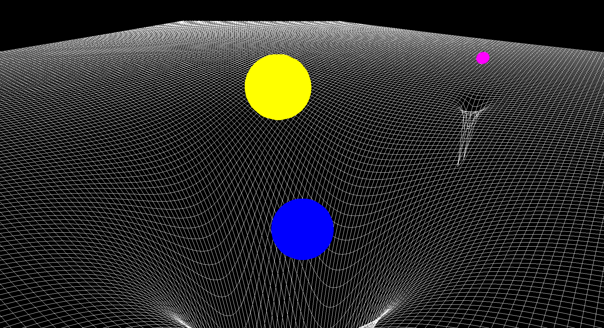

# Chiro Gravity Simulator!

A Gravity Simulator crafted to explore the fascinating dynamics of gravitational forces within custom solar systems. Users can define their own celestial bodies by setting masses, positions, and velocities to simulate realistic gravitational interactions. A key feature is the visual depiction of the spacetime fabric, showcasing how massive objects warp spacetime to produce gravitational effects. The intuitive interface supports easy adjustments, making it a great resource for students, educators, and astrophysics enthusiasts.

## Install and Setup
To install the simulator, first copy the github link and open up your terminal:
+ Inside the terminal, navigate to some directory where you wish to install the project.
+ Clone the project repo into the directory using the 'git clone' command and the url of the github repo copied previously.
+ If not done so already, install MinGW for your system.

### Setup
+ If MinGW is already setup on your system, you are ready to build the file.
+ Open up terminal in your project's root directory.
+ For Windows systems:
-- Type in the command ".\run_simulator.ps1 build" to build the project
-- Once an exe file shows up inside the project's build folder, type in ".\run_simulator.ps1 run" to run the project.
+ For Linux systems:
-- Type in the command ".\run_simulator.sh build" to build the project
-- Once an exe file shows up inside the project's build folder, type in ".\run_simulator.sh run" to run the project.

## Configuration and Custom Bodies
To change the configuration settings of the project, open the Configurations.json file inside the data folder. The values in this file can be changed but do so with care as they may change the simulation with vast consequences.
To implement custom systems, change the data inside the BodiesData.json file inside the data folder, while keeping the same template for the data for the planets and suns. Important system configurations are kept inside the ImportantSystemConfigurations.txt file as examples.

## Examples
